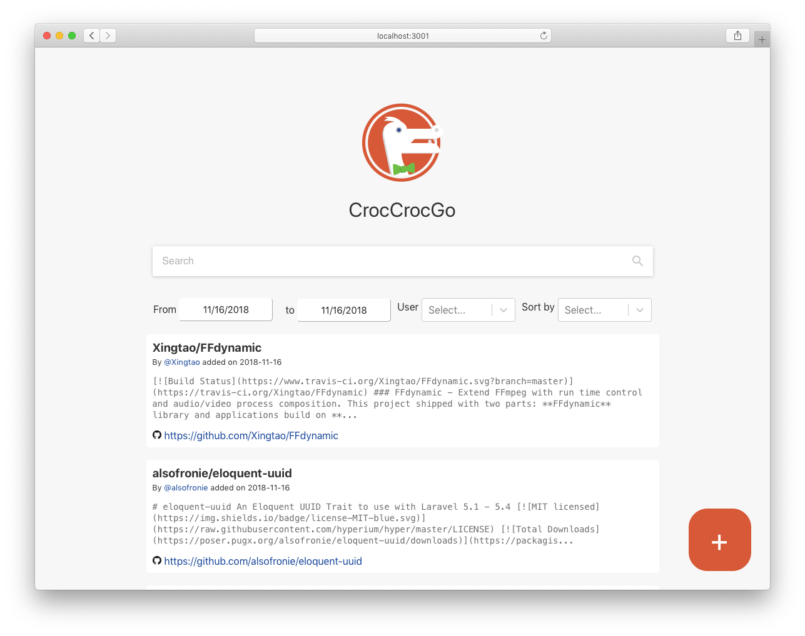
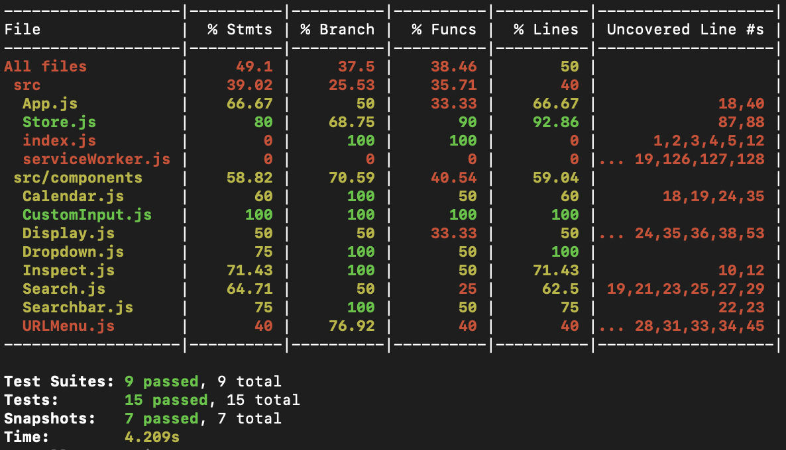

IT2810 - Prosjekt 4, gruppe 19



# CrocCrocGo

- **Ahsan Azim** [@ahsana](https://gitlab.stud.idi.ntnu.no/ahsana)
- **Johannes Tomren Røsvik** [@j](https://gitlab.stud.idi.ntnu.no/j)
- **Pål Fossnes** [@paalfos](https://gitlab.stud.idi.ntnu.no/paalfos)

## Funksjonalitet

CrocCrocGo er en søkemotor for GitHub README-filer. Søkemotoren støtter sortering og filtering på både dato, brukernavn og innhold. Det er mulig for brukere å legge til flere filer i databasen ved å trykke på '+'-knappen nede i høyre hjørne. Det må også nevnes at logoen gjør en 360 når musepekeren holdes over den.

Når man legger til nye urler forventer applikasjonen et veldig spesifikt URL-format, så her er noen eksempler på urler som kan brukes for testing:

```
raw.githubusercontent.com/git/git/master/README.md
raw.githubusercontent.com/Gargron/mastodon/master/README.md
raw.githubusercontent.com/vagnes/pyparazzi/master/README.md
```

## Kjøring av appen

For å kjøre appen, trenger man Node.js, NPM og MySQL installert. **For at appen skal fungere lokalt, må man være koblet til NTNU VPN.**

### Installering

Prosjektet er delt i to deler: frontend og backend. For å installere alle node pakkene, må man derfor kjøre `npm install` to steder.

```
cd backend/
npm install
cd ../frontend/
npm install
```

For å sette opp en fungerende database, må man i MySQL-kommandolinjen kjøre ett sett med kommandoer:

1. Opprett database it2810;

`CREATE DATABASE it2810;`

2. Lag MySQL bruker 'ntnu' med passordet 'kakekake'

`CREATE USER 'ntnu'@'localhost' IDENTIFIED BY 'kakekake';`

3. Gi brukeren tilgang til databasen

`GRANT ALL PRIVILEGES ON *.* TO 'ntnu'@'localhost' WITH GRANT OPTION;`

For å fylle databasen med eksempeldata, last ned filen [it2810_2018-11-07.sql](/uploads/8de0feceafbc683244bc5ed449b4da7a/it2810_2018-11-07.sql) og importer den i MySQL ved å kjøre

`mysql it2810 < it2810_2018-11-07.sql;`

Pass så på at MySQL-serveren kjører lokalt på maskinen før du starter applikasjonen.

### Oppstart

For å starte prosjektet, må en først kjøre backend-delen av prosjektet, så frontend.

```
cd backend/
npm start
```

```
cd frontend/
npm start
```

Etter å ha startet frontenden, vil du bli spurt om du vil kjøre prosjektet på en annen port. Svar ja ved å skrive 'Y'.

Backend prosjektet skal nå være tilgjengelig på port 3000 ([localhost:3000](http://localhost:3000)) og frontenden på port 3001 ([localhost:3001](http://localhost:3001))

### Installering av ESLint (for utvikling)

Under utvikling brukte vi ESLint for å ha konsistent formatering av kode. Dette gjorde vi i ved å installere pakken [vscode-eslint](https://github.com/Microsoft/vscode-eslint) i Visual Studio Code, som er editoren vi valgte å bruke.

## Diskusjon av viktige valg

> Dokumentasjonen skal diskutere, forklare og vise til alle de viktigste valgene og løsningene som gruppa gjør (inklusive valg av komponenter og api).

### Frontend / backend

Applikasjonen er delt i to helt seperate deler. Den ene delen er en REST API implementert i Node.js og Express, som snakker med en MySQL-database og utfører det som trengs serverside. Den andre delen er en React applikasjon som genererer brukergrensesnittet. Vi valge å gjøre det slik fordi det var slik vi tolket oppgaven, og det demonsterer at de to delene er helt seperate.

Vi syns ikke nødvendligvis at dette er den beste måten å gjøre det på, ettersom det finnes gode utgangspunkt for applikasjoner som fungerer som ett node prosjekt, men består av en frontend og backend del. (Se f.eks. [crsandeep/simple-react-full-stack](https://github.com/crsandeep/simple-react-full-stack)) Å gjøre det på denne måten hadde gjort at vi slapp å bruke to node_modules mapper, to prosesser for oppsett osv.

### ESLint

I dette prosjektet valgte vi å ta i bruk ESLint. ESLint er et verktøy som finner syntaks- og formateringsfeil i koden mens den skrives. Vi valgte å bruke [AirBnbs formateringsregler](https://www.npmjs.com/package/eslint-config-airbnb) som er en populær liste med regler for JavaScript/React prosjekter. Dette gjorde at vi skrev mindre feil, og endte opp med kode som er konsistent ovenfor best-practice ES6 regler og formatering.

En av kravene til AirBnbs formateringsregler er at man definerer hvilke props som en komponent forventer å få. Her brukes et rammeverk som heter [prop-types](https://www.npmjs.com/package/prop-types). Vi kunne ha vært bedre på å bruke dette på riktig måte fordi det stort sett var en MobX 'store' prop som ble gitt mellom komponentene våre.

### Express / MySQL

Vi valgte å sette opp en REST API gjennom Express for håndtering av søk, og MySQL for lagring av data. Vi valgte en REST Express API fordi det er noe vi hadde jobbet med fra før, men aldri implementert selv. Det var derfor en god mulighet til å få veldig relevant erfaring som vi mest sannsynelig kommer til å få bruk for i fremtiden. MySQL er noe vi alle hadde erfaring med fra før, så det var en rask og enkel løsning på databasekravet.

Når vi satt opp APIen, tok vi inspirasjon fra andre APIer vi hadde brukt før for å organisere URLer og få en oversiktlig API. Den endte opp med å se slik ut:

- `GET /api/entries`: Get all entries
- `POST /api/entries` with data `{ url: [url] }`: Add an entry to the database by [url]
- `GET /api/entries/[id]`: Get a single entry by [id]
- `GET /api/entries/search` with parameters `query, after, before, author, sortby, page`: Main search engine.
- `GET /api/entries/author/[author]`: Get all entries from [author]
- `GET /api/authors`: Get all distinct authors

Se issue [#2](https://gitlab.stud.idi.ntnu.no/it2810-h18/prosjekt3/gruppe19/issues/2) for mer info om hvordan APIen fungerer.

Jeg skriver ikke mer om oppsett, installering og formatering av MySQL-databasen her, siden det er godt dokumentert i issue [#1](https://gitlab.stud.idi.ntnu.no/it2810-h18/prosjekt3/gruppe19/issues/1). Der er det også forklart hvordan vi genererte data i starten av prosjektet ved å bruke GitHub sin API.

### Testing

Vi valgte å bruke Jest og Cyress for testing av prosjektet vårt. Cypress var gitt som et forslag til end-to-end testing, så vi gikk for det, ettersom ingen av oss hadde erfaring med noe annet, og det så ut som et greit verktøy.

Under hele utviklingsprosessen brukte vi et utvalg nettlesere på både Windows og Mac for å forsikre oss om at nettsiden fungerte som forventet. Fordi vi bruker Babel til kompilering av koden vår, forventer vi at den skal fungere for nettlesere som har en markedsandel over 0,2%. Vi sjekker uansett manuelt at layout og styling fungerer for de siste versjonene av Google Chrome, Safari og Firefox på Mac og Windows.

Vi valgte denne gangen å ikke bruke tid på å lage siden responsiv, ettersom det ikke var gitt som en del av oppgaven.

#### Jest

For testing i dette prosjektet var det et krav om å bruke Jest. Jest er et rammeverk som implementerer test-støtte i JavaScript. Vi utførte snapshot, coverage og unit tester med Jest.

Testene ligger i mappen `frontend/src/components/test`.

Bakgrunnen for bruken av snapshot testing er at vi vil forsikre oss om at hver gang vi kjører testene våre vil outputen av vår test render matche hva det var tidligere (eller oppdatere disse snapshotene når de endrer seg som forventet). Snapshot testing er med andre ord et veldig nyttig verktøy når man vil forsikre seg om at UI'et sitt ikke endrer seg uventet. Neste gang man kjører testene vil outputen som blir rendered bli sammenlignet med snapshotet som ble lagd tidligere. Om en snapshot test feiler, må man undersøke om forandringen er ønsket eller ei. Dersom forandringen er ønsket kan man kalle Jest ved å bruke `npm test -- --u` for å overskrive det eksisterende snapshotet.

Vi brukte unit-testing for å sjekke om oppførselen til funksjonene våre var som planlagt. Vi valgte å kjøre snapshot-tester på alle komponentene våre, og skrive mer grundige unit tester for Store.js og URLMenu.js.

Testene kjøres ved å kjøre:

```
cd frontend/
npm test
```

Vi brukte coverage testing tor å se dekningsgraden av testing vi hadde utført.

```
npm test -- --coverage
```



Ovenfor, har vi lagt til et bildet av testresultatene.

#### Cypress

Hoveddelen av testingen i cypress skjer i filen `/frontend/cypress/integration/duckduckgo_spec.js`. Her valgte vi å dele de 16 testene våre i 5 kategorier, som til sammen dekker det aller meste av funksjonalitet i applikasjonen.

Testene kjøres slik:

```
cd frontend/
node_modules/.bin/cypress open
```

Resultatet blir slik:


### MobX

Når vi startet på dette prosjektet hadde vi instillingen at vi ville bruke Redux som vårt state management bibliotek, siden dette var det vi hadde hørt mest om fra før. Men etter å ha studert forskjellene mellom MobX og Redux, kom vi frem til at MobX var en mye enklere løsning for vårt prosjekt som hadde mer en nok funksjonalitet. Vi var veldig fornøyd med dette valget, ettersom det tok oss lite tid å sette opp MobX, og det var ikke mye mer komplisert å bruke enn den vanlige React staten som vi var vant med. Vi slapp også å bruke masse boilerplate-kode for hver gang vi ville snakke med den globale staten.

Se issue [#5](https://gitlab.stud.idi.ntnu.no/it2810-h18/prosjekt3/gruppe19/issues/5) for mer informasjon om vår implemetering av MobX.

### UI-komponenter

Vi valgte å bruke [Material-UI](https://material-ui.com) biblioteket for noen av komponentene våre. Dette er et populært rammeverk baserer seg på Google sitt minimalistiske designspråk. Vi brukte search-bar komponenten for hovedsøkefeltet og modal komponenten for overlays i Inspect og URLMenu komponentene våre.

Vi brukte også [react-datepicker](https://reactdatepicker.com) og [react-select](https://react-select.com/) som var enkle løsninger på filteringskomponentene vi trengte.

### Showdown

[Showdown](http://showdownjs.com) er et bibliotek for å konvertere markdown til HTML (og andre veien) som vi brukte i APIen til å lagre en HTML representasjon av README-filene som ble lagret. Vi kunne ha gjort denne konverteringen i React etter at søket ble gjort, men vi syns dette var en god og enkel løsning som har fungert bra.

## Brukte rammeverk

- [React](https://reactjs.org) - JavaScript rammeverk for webapplikasjoner
- [NPM](http://npmjs.com) - Avhenigheter og bibliotekinstallasjon
- [Express](https://expressjs.com) - Rammeverk for Node.js brukt til å lage vår REST API
- [ESLint](https://eslint.org) - JavaScript linting verktøy
- [eslint-config-airbnb](https://www.npmjs.com/package/eslint-config-airbnb) - Airbnbs JavaScript stil-rettningslinjer
- [ReactJS Datepicker](https://reactdatepicker.com) - Datovelger-komponent
- [prop-types](https://www.npmjs.com/package/prop-types) - Type checking for React props.
- [MobX](https://mobx.js.org) - State management
- [Axios](https://www.npmjs.com/package/axios) - Rammeverk for HTTP requests.
- [Material-UI](https://www.npmjs.com/package/@material-ui/core) - React komponenter som bruker Googles Material Design.
- [Prettier](https://prettier.io) - Kodeformaterings-plugin
- [Showdown](http://showdownjs.com) - Markdown til HTML konvertering
- [Jest](https://jestjs.io) - Javascript testerammeverk
- [Cypress](https://www.cypress.io) - Testing for alt som kjører i en nettleser.
