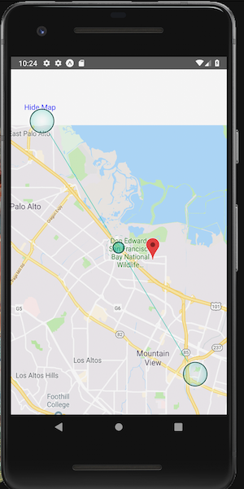

IT2810 - Prosjekt 3, gruppe 19


# Todo Manager

Todo Manager er en "personal information manager" som gir deg medaljer utifra hvor mye du bruker appen.

- **Ahsan Azim** [@ahsannazim](https://github.com/ahsannazim)
- **Johannes Tomren Røsvik** [@rosvik](http://github.com/rosvik)
- **Pål Fossnes** [@Palfos23](http://github.com/Palfos23)

## App funksjonalitet

Todo Manager har tre hovedfunksjoner:

1. En todo-liste med oversikt over dine todos.
2. Et kart over hvor hver todo har ble opprettet geografisk. (Ved å trykke på en todo)
3. Oversikt over dine oppnådde medaljer.


## Oppstart

For å kjøre appen, trenger man Expo og Node.js/NPM installert.

### Installing

Installer node pakker

```
npm install
```

Bygg prosjektet med expo

```
expo start
```

Scan QR-koden fra terminalen eller nettsiden med en QR-leser for å åpne applikasjonen.

## Kjøre testene

Når man benytter seg av

```
react-native init
```

vil man automatisk få inkludert jest i prosjektet man starter

Kjør alle tester som ligger i en '**tests**' mappe, slutter på spec.js eller slutter på test.js med

```
npm test
```

### Snapshot testing

Vår første test var ganske enkel, å lage en "snapshot" av render-outputen for vår første komponent (Todo)

```
import "react-native";
import React from "react";
import Todo from "../Todo";
import renderer from "react-test-renderer";

it("renders correctly", () => {
  const tree = renderer.create(<Todo />).toJSON();

  expect(tree).toMatchSnapshot();
});
```

Alle snapshots blir lagret i "**tests**/**snapshots**/".
Man kan da sjekke ut resultatet i Todo-test.js.snap.

Bakgrunnen for bruken av snapshot testing er at vi vil forsikre oss om at hver gang vi kjører testene våre vil outputen av vår test render matche hva det var tidligere (eller oppdatere disse snapshotene når de endrer seg som forventet). Snapshot testing er med andre ord et veldig nyttig verktøy når man vil forsikre seg om at UI'et sitt ikke endrer seg uventet.
Neste gang man kjører testene vil outputen som blir rendered bli sammenlignet med snapshotet som ble lagd tidligere. Om en snapshot test feiler, må man undersøke om forandringen er ønsket eller ei. Dersom forandringen er ønsket kan man kalle Jest ved å bruke

```
npm test -- --u
```

for å overskrive det eksisterende snapshotet.

### Unit testing

Unit testing med Jest gjøres som i det aller fleste rammeverk. Man har en tilnærmet engelskspråklig syntax, eksempler på dette er:

```
expect(answer)toBeTruthy();
expect(value)toBeGreaterThan(6);
expect(compileAndroidCode).toThrow(ConfigError);
```

### Coverage

Se test-coverage med

```
npm test -- --coverage
```

En ting som er verdt å merke seg ved dette prosjektet er at vi er ute etter å vise at vi kan teste komponentene våre (basic unit testing) med bruk av jest. Test-coverage står dermed ikke i hovedfokus i dette prosjektet.

Vi har hatt en del problemer når det kommer til testing av komponenter med MapView og Marker. Vi har prøvd å finne mock-løsninger (funnet på blant annet stackoverflow), men dette er ikke noe vi føler oss helt trygge på å gjøre uten å forstå hva som skjer. På grunn av dette får vi en test som feiler. Dette er Main-test.js, og feilen vi får er "TypeError: this.map.setNativeProps is not a function". Hadde vært fint å finne svar på det, men det tok for lang tid å sette seg inn i dette så vi prioriterte de viktigere delene av prosjektet.

### Emulators

I tillegg til å benytte oss av expo-appen har vi lastet ned emulatorer både for android og ios for å teste appen vår. Det var spesielt viktig for oss å teste på android da ingen av oss er i besittelse av en slik mobiltelefon. Dette ga oss også muligheten til å teste appen i andre skjermstørrelser enn de vi har selv.

## Diskusjon av viktige valg

> Dokumentasjonen skal diskutere, forklare og vise til alle de viktigste valgene og løsningene som gruppa gjør (inklusive valg av komponenter og api).

Vi valgte å gjøre appen vår ganske enkel og uten for mange unødvendige komponenter som egentlig ikke har noen funksjon til systemet. Dette ser man tydelig ved at vi har valgt å bare ha 2 "tabs", den ene inneholder todos og den andre achievements.

Selv om todos-siden virker ganske enkel, inneholder den også en MapModal som viser hvor i verden hver todo ble skapt. Vi har altså valgt å benytte oss av expo sitt maps api (gps). Vi følte at dette var en mer relevant funksjon enn for eksempel en skritteller. Selve kartet er implementert i en såkalt "modal", altså et pop-up-vindu. Vi følte at dette var en løsning som viser kartfunksjonen på en fin og ryddig måte.

For å booste innsatsen til brukeren er det som sagt implementert en achievements-side med "trofeer". Her kan man få en liten premie basert på hvor mange todos man har gjort både iløpet av en dag og helt siden man begynte å benytte seg av appen. Her har vi benyttet oss av asyncStorage (noe som blir presentert under).

Som en konsekvens av våre simplistiske valg står vi igjen med et ganske oversiktlig prosjekt og relativt få komponenter. Dette er et valg vi står ved, spesielt med tanke på læringseffekten av å gjøre ting på en ordentlig måte. Vår oppfatning er at vi får lært mye mer når vi holder ting enkelt i motsetning til når man velger å gjøre ting litt for komplisert enn det trenger å være. Vi føler uansett at vi har tilført alt av krav til både teknologi og funksjonalitet til prosjektet.

Vi valgte å bruke flere komponenter fra Expo, som vi syns var enkle og bruke, i tillegg til at det dekte våre behov til funksjonalitet. Vi endte opp med å ikke hente så mange komponenter fra andre kilder, fordi vi ikke hadde ønsker om å implementere mer avanserte komponenter enn vi fikk til på egen hånd. Dette viser at React Native i kombinasjon med Expo er et kraftig verktøy med mange nyttige ressurser for apputvikling.

## Tutorials for valg av teknologi

> Gruppas valg av teknologi som utforskes (jmfr krav til innhold) skal dokumenteres i tutorials form slik at andre lett kan lære av eksempelet dere lager (dvs. gi en liten introduksjon til hva og hvordan).

### AsyncStorage

AsyncStorage et React Native bibliotek for å lagre ukryptert data lokalt på enheten. Biblioteket fungerer ved å gi hver verdi som lagres en unik nøkkel, som oppgis når man ønsker å hente dataen ut igjen senere.

For å lagre data er dette et enkelt eksempel (hentet fra [React Native sin dokumentasjon](https://facebook.github.io/react-native/docs/asyncstorage)):

```
_storeData = async () => {
  try {
    await AsyncStorage.setItem('@MySuperStore:key', 'I like to save it.');
  } catch (error) {
    // Error saving data
  }
}
```

Her er `@MySuperStore:key` nøkkelen til dataen `I like to save it.`.

Å hente ut data senere fungerer slik:

```
_retrieveData = async () => {
  try {
    const value = await AsyncStorage.getItem('@MySuperStore:key');
    if (value !== null) {
      // We have data!!
      console.log(value);
    }
   } catch (error) {
     // Error retrieving data
   }
}
```

I vårt prosjekt gir vi nøkkel og data som attributter til `_storeEntry`. Vi har valgt å bruke JSON for lagring, derfor konverterer vi til tekst før det lagres.

```
_storeEntry = async (key, data) => {
  try {
    await AsyncStorage.setItem(key, JSON.stringify(data));
  } catch (error) {
    Alert.alert('Error saving data');
  }
}
```

### Expo Location og Permissions

Expo kommer med to funksjoner, Location og Permission, som gjør det mulig å hente brukerens geografiske posisjon.

Start ved å importere biblioteneke fra Expo.

```
import { Location, Permissions } from 'expo';
```

Først må man be om tilatelse til å bruke posisjonen til brukeren.

```
let { status } = await Permissions.askAsync(Permissions.LOCATION);
```

Her vil status variabelen bli satt til "granted" hvis brukeren godtar. Deretter vil man kunne få tak i lokasjonen.

```
let location = await Location.getCurrentPositionAsync({});
```

En full implementering av dette vil se noe slik ut:

```
_getLocationAsync = async () => {
  try {
    let { status } = await Permissions.askAsync(Permissions.LOCATION);

    if (status !== 'granted') {

      // User denied access

    } else {

      // Get location
      let location = await Location.getCurrentPositionAsync({});

      // Save location
      this.setState({ loc: location });
    }
  } catch (e) {
    console.log(e);
  }
};
```

## Arbeidsmetodikk

### Git og koding

For å holde orden på progresjonen i utvklingen av produktet vårt har vi brukt github. I startfasen av prosjektet lagde vi issues som beskrivde hva som måtte gjøres. Ut i fra disse issuesene opprettet vi branches. Sammarbeidet/arbeidsfordelingen har vært grei, selv om noen tok litt mer ansvar enn andre. Vi kunne dog vært bedre på å pushe tidlig i utviklingen, noe vi ble mye bedre på i sluttfasen. Før vi startet opprettet vi en policy om å relatere commits til issues for å styrke strukturen i utviklingen. Dette føler vi at vi har gjort meget bra (med et par unntak selvsagt).

Koden er godt kommentert og oversiktlig. Dette gjør det enklere for folk utenfra å forstå hele prosjektet vårt. Den er også godt strukturert med komponenter, tester osv. Komponenter, variabler og lignende er navngitt etter best practise. Dette er noe vi alltid prøver å gjøre skikkelig og som hjelper på å gjøre koden enda mer oversiktlig og fin.

### Gruppearbeid

Som sagt over føler vi at sammarbeidet innad i gruppen har vært grei, dessverre ikke utmerket da vi fortsatt ikke har lært hverandre å kjenne. Dette merket vi for eksempel de gangene vi ville sette opp arbeidsmøter (forskjellig døgnrytme etc). Noen har også tatt mer ansvar enn andre, men samtidig har de som har tatt ansvar for ulike deler forklart godt hva de har gjort til de andre medlemmene av gruppen. Det er også enstemmig vedtatt at alle har lært masse om både react-native, jest, asyncStorage og det å arbeide i team (både positive og negative sider).

## Brukte rammeverk

- [React Native](https://facebook.github.io/react-native/) - JavaScript rammeverk for mobile applikasjoner
- [NPM](http://npmjs.com) - Avhenigheter og bibliotekinstallasjon
- [Expo](https://expo.io) - Bygging av applikasjonen
- [Jest](https://jestjs.io) - Testing

## Mangler

Før levering av oppgaven oppdaget vi en bug som gjorde at kartvisningen ikke fungerer jevnt på Android enheter. Vi hadde ikke tid til å fikse feilen, men vi vet at problemet ligger i at geolokasjonsfunksjonen på android ikke alltid fungerer slik som vi har antatt. Vedlagt er et skjermbilde som viser en fungerende versjon av kartvisningen på android. Nålen viser at vi er i San Francisco, fordi dette er posisjonen Android-simulatoren gir til appen vår.


